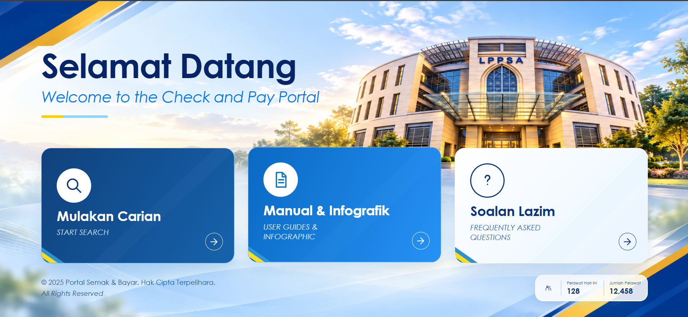

# LPPSA Check & Pay Portal

A responsive Check & Pay portal interface concept bringing account search, payment guidance, and frequently asked questions into one clear experience.

[View the interface showcase](https://aidilsyahmi.github.io/pis-portal-developer/)

## Highlights

- Account search interface concept
- User guides and infographics
- Frequently asked questions

## Public portfolio scope

This folder intentionally contains only `index.html` and `README.md`. The preview image is stored in the portfolio's shared `assets/projects` directory.

This is a static design showcase, not a live operational service. Application source, backend logic, environment configuration, credentials, databases, account details, survey responses, uploads, and internal documents are not included.

## Viewing

Open the showcase link above, or serve the portfolio root with a local static web server. No dependencies or build step are required.
